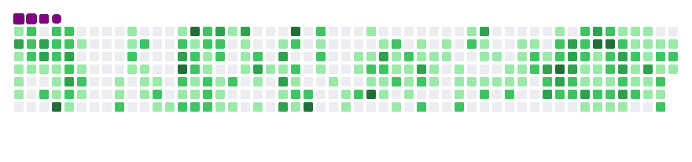

  

  <h1>Hi, I'm Yağız Berk Önay 👋</h1>
  

  
  
  
  

 

## 💼 Executive Summary

I am a software engineer and systems architect specializing in building highly scalable enterprise web applications and integrating advanced artificial intelligence models into production environments. With a strong focus on modern UI/UX paradigms (Bento Grid, Neo-Brutalism) and robust backend infrastructures, I bridge the gap between complex R&D concepts and market-ready enterprise solutions.

*   **Enterprise Architecture:** Leading digital infrastructure and cloud deployments for organizations such as **Hermes Software A.Ş.**, **Marş Scooter**, and **Kahramanmaraş Ulaşım**.
*   **AI-Driven R&D:** Co-architect of **Engelsiz Gözler**, an advanced assistive technology ecosystem for the visually impaired (TEKNOFEST Health AI Finalist).
*   **API Orchestration:** Designing modular architectures leveraging state-of-the-art APIs (Tavily, ElevenLabs, Claude, Google AI Pro).

---

## 🚀 Featured Projects

| Project Logo / Banner | Description | Technologies |
| :---: | :--- | :--- |
|  | **Engelsiz Gözler**   An advanced hardware/software ecosystem designed to provide AI-powered assistive technologies for the visually impaired. | `Python`, `AI Vision`, `IoT` |
|  | **Automated Food Service Systems**   Technical architecture and API integration for next-generation Smart Vending Machine infrastructures. | `Node.js`, `React`, `Hardware API` |
|  | **Enterprise Infrastructure**   Scalable domain architectures and deployments optimizing performance across distributed systems. | `Next.js`, `Vercel`, `AWS` |

> *Not: Projelerin gerçek logo veya ekran görüntülerini `src=""` içerisine ekleyerek tabloyu görsel bir şölene dönüştürebilirsin.*

---

## 🛠️ Technical Arsenal

### Frontend & Backend

### Cloud & DevOps

### AI & Data Integration

---

## 🏆 GitHub Achievements & Stats

  

 

  
  

  

